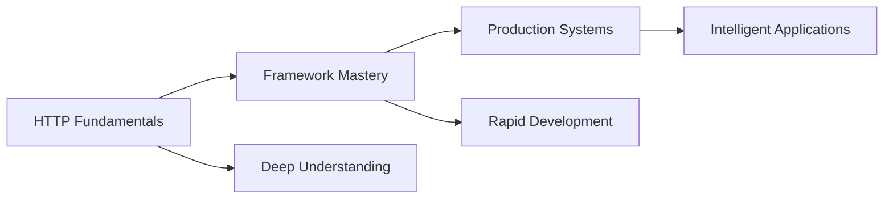
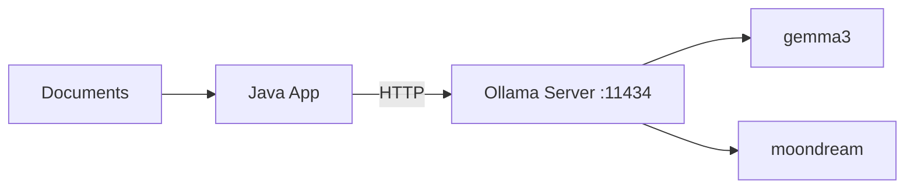
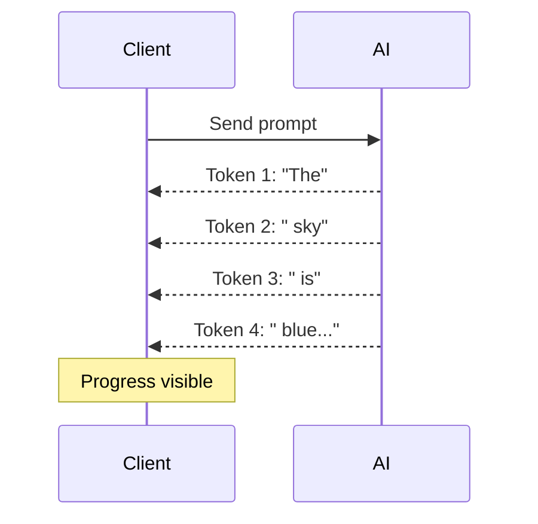
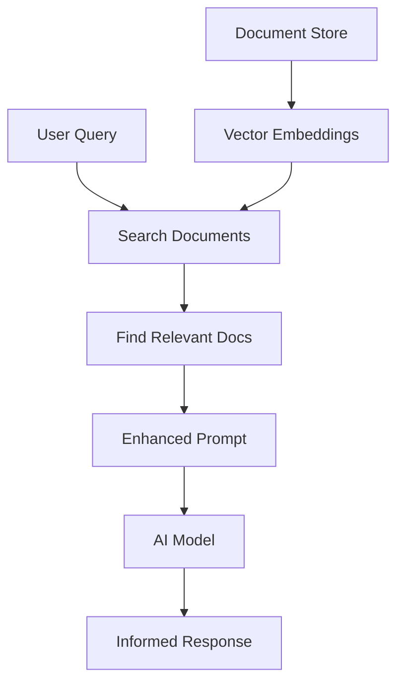
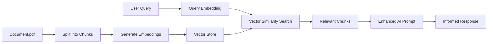

# AI Java Labs: Building Intelligent Java Applications

<div class="pt-12">
  <span @click="$slidev.nav.next" class="px-2 py-1 rounded cursor-pointer" hover="bg-white bg-opacity-10">
    From HTTP fundamentals to advanced RAG systems <carbon:arrow-right class="inline"/>
  </span>
</div>

<div class="abs-br m-6 flex gap-2">
  <button @click="$slidev.nav.openInEditor()" title="Open in Editor" class="text-xl slidev-icon-btn opacity-50 !border-none !hover:text-white">
    <carbon:edit />
  </button>
  <a href="https://github.com/kousen/AiJavaLabs" target="_blank" alt="GitHub" title="Open in GitHub"
    class="text-xl slidev-icon-btn opacity-50 !border-none !hover:text-white">
    <carbon-logo-github />
  </a>
</div>

---

# Contact Info

Ken Kousen<br>
Kousen IT, Inc.

- ken.kousen@kousenit.com
- http://www.kousenit.com
- http://kousenit.org (blog)
- Social Media:
  - [@kenkousen](https://twitter.com/kenkousen) (Twitter)
  - [@kousenit.com](https://bsky.app/profile/kousenit.com) (Bluesky)
  - [https://www.linkedin.com/in/kenkousen/](https://www.linkedin.com/in/kenkousen/) (LinkedIn)
- *Tales from the jar side* (free newsletter)
  - https://kenkousen.substack.com
  - https://youtube.com/@talesfromthejarside

---
layout: two-cols
---

# What You'll Learn

<v-clicks>

- **HTTP Fundamentals**: Raw API integration patterns
- **<span style="color: #00D4FF">LangChain4j</span> Framework**: High-level AI abstractions
- **Text Generation**: OpenAI and Ollama models
- **Streaming Responses**: Real-time token-by-token output
- **Multimodal AI**: Vision, audio, and image generation
- **RAG Systems**: Document-based question answering
- **Cost Management**: Efficient testing and model selection
- **Modern Java**: Records, sealed interfaces, pattern matching

</v-clicks>

::right::

<div class="mt-8">

</div>

<!-- Presenter notes: Emphasize dual approach - understanding both raw HTTP and frameworks -->

---

# Repository Structure

```bash
AiJavaLabs/
├── labs.md                    # 15 progressive lab exercises
├── src/
│   ├── main/java/com/kousenit/
│   │   ├── demos/
│   │   │   ├── QuickChatDemo.java      # Fast OpenAI demo
│   │   │   ├── TextToSpeechDemo.java   # TTS generation
│   │   │   ├── LocalOllamaDemo.java    # Local AI models
│   │   │   ├── MultiModelDemo.java     # Provider comparison
│   │   │   ├── ResponsesApiDemo.java   # Raw HTTP examples
│   │   │   ├── ApiComparisonDemo.java  # Framework vs raw
│   │   │   └── StreamingDemo.java      # Real-time responses
│   │   ├── EasyRAGDemo.java           # Document Q&A
│   │   ├── *Service.java              # Core implementations
│   │   └── *Records.java              # Data models
│   └── test/java/              # Comprehensive test suite
├── build.gradle.kts           # Test categories for cost control
└── slides.md                  # This presentation
```

<v-clicks>

- **8 Live Demos**: Ready-to-run examples for each topic
- **Cost-Controlled Testing**: Free local tests, cheap API tests
- **Modern Java 21**: Records, sealed interfaces, pattern matching
- **Dual Learning Path**: Raw HTTP + LangChain4j frameworks

</v-clicks>

---

layout: two-cols
---

# Demo Map

- Quick Chat: `com.kousenit.demos.QuickChatDemo`
- Local Ollama: `com.kousenit.demos.LocalOllamaDemo`
- Multi-Model: `com.kousenit.demos.MultiModelDemo`
- Text-to-Speech: `com.kousenit.demos.TextToSpeechDemo`
- Streaming: `com.kousenit.demos.StreamingDemo`
- API Comparison: `com.kousenit.demos.ApiComparisonDemo`
- Responses API (Gson): `com.kousenit.demos.ResponsesApiDemo`
- Responses API (Jackson): `com.kousenit.demos.ResponsesApiJacksonDemo`
- Easy RAG: `com.kousenit.EasyRAGDemo`

::right::

```bash
# Run any demo
./gradlew run -PmainClass=<fully.qualified.Class>

# Examples
./gradlew run -PmainClass=com.kousenit.demos.QuickChatDemo
./gradlew run -PmainClass=com.kousenit.demos.LocalOllamaDemo

# Prereqs
# - OPENAI_API_KEY for cloud demos
# - Ollama running locally for local demos
```

---

# Course Philosophy: Understanding Both Levels

<div class="grid grid-cols-2 gap-8">

<div>

## **Why Learn Raw HTTP First?**

<v-clicks>

- **<span style="color: #00D4FF">True Understanding</span>**: Know what frameworks do under the hood
- **<span style="color: #00D4FF">Debugging Skills</span>**: When frameworks fail, you can troubleshoot
- **<span style="color: #00D4FF">Flexibility</span>**: Not locked into any single framework
- **<span style="color: #00D4FF">Performance</span>**: Optimize for your specific needs

</v-clicks>

</div>

<div>

## **Then Master Frameworks**

<v-clicks>

- **<span style="color: #00D4FF">Productivity</span>**: LangChain4j handles boilerplate
- **<span style="color: #00D4FF">Best Practices</span>**: Proven patterns and abstractions  
- **<span style="color: #00D4FF">Advanced Features</span>**: RAG, streaming, memory
- **<span style="color: #00D4FF">Rapid Development</span>**: Focus on business logic

</v-clicks>

</div>

</div>

<v-click>



</v-click>

---

# Prerequisites

<div class="grid grid-cols-2 gap-8">

<div>

## Technical Requirements

<v-clicks>

- **Java 21+** (Records, sealed interfaces, pattern matching)
- **Gradle 8.4+** (Kotlin DSL, test categories)
- **<span style="color: #00D4FF">LangChain4j 1.4.0</span>** (Latest AI framework)
- **Git** for repository management
- **Ollama** (optional, for local AI models)

</v-clicks>

</div>

<div>

## Environment Setup

```bash
# Required API keys
export OPENAI_API_KEY=your_key
# Optional providers used in demos/tests
export GOOGLEAI_API_KEY=your_key
export PERPLEXITY_API_KEY=your_key

# Optional: Local AI models
curl -fsSL https://ollama.com/install.sh | sh
ollama pull gemma3
ollama pull moondream  # For vision

# Clone and start
git clone <repo-url>
./gradlew build
./gradlew testDemo  # Quick validation

# Slides
npm install
npx slidev slides.md
# Export to PDF (requires Playwright)
npx slidev export slides.md
```

</div>

</div>

---

# Cost Management Strategy

<div class="grid grid-cols-3 gap-6">

<div>

## **Test Categories**

<v-clicks>

- `@Tag("local")` - **Free** Ollama tests
- `@Tag("cheap")` - **Low-cost** nano models
- `@Tag("demo")` - **Fast** live demos
- `@Tag("expensive")` - **Avoided** by default

</v-clicks>

</div>

<div>

## **Gradle Tasks**

```bash
./gradlew testLocal      # $0
./gradlew testCheap      # ~$0.01
./gradlew testDemo       # ~$0.05
./gradlew testNotExpensive
./gradlew testOpenAI
```

</div>

<div>

## **Model Costs (Approximate; subject to change)**

<v-clicks>

- **<span style="color: #00D4FF">gpt-5-nano</span>**: very low per-token cost
- **<span style="color: #00D4FF">gemma3 (local)</span>**: Free with Ollama
- **<span style="color: #00D4FF">dall-e-3</span>**: $0.040 per image
- **<span style="color: #00D4FF">gpt-4o-mini-tts</span>**: low cost per minute of audio

</v-clicks>

</div>

</div>

<v-click>

**Smart Strategy**: Develop with free local models, deploy with optimal cloud models

</v-click>

---
layout: section
---

# Demo 1-2: HTTP Fundamentals
## Understanding Raw API Integration

---

# Demo 1: Text-to-Speech with Raw HTTP

````md magic-move
```java
// Raw HTTP approach - Understanding the fundamentals
public class TextToSpeechService {
    private static final String OPENAI_API_KEY = System.getenv("OPENAI_API_KEY");
    private static final HttpClient client = HttpClient.newHttpClient();
    
    public Path generateMp3(String model, String input, String voice) {
        // TODO: How do we construct the request?
    }
}
```

```java
// Step 1: Create JSON payload manually
String payload = """
    {
        "model": "%s",
        "input": "%s", 
        "voice": "%s"
    }
    """.formatted(model, input.replaceAll("\\s+", " ").trim(), voice);
```

```java
// Step 2: Build HTTP request with proper headers
HttpRequest request = HttpRequest.newBuilder()
    .uri(URI.create("https://api.openai.com/v1/audio/speech"))
    .header("Authorization", "Bearer %s".formatted(OPENAI_API_KEY))
    .header("Content-Type", "application/json")
    .header("Accept", "audio/mpeg")
    .POST(HttpRequest.BodyPublishers.ofString(payload))
    .build();
```

```java
// Step 3: Complete implementation with file handling
public Path generateMp3(String model, String input, String voice) {
    String payload = """
        {
            "model": "%s",
            "input": "%s",
            "voice": "%s"
        }
        """.formatted(model, input.replaceAll("\\s+", " ").trim(), voice);
    
    HttpRequest request = HttpRequest.newBuilder()
        .uri(URI.create("https://api.openai.com/v1/audio/speech"))
        .header("Authorization", "Bearer %s".formatted(OPENAI_API_KEY))
        .header("Content-Type", "application/json")
        .header("Accept", "audio/mpeg")
        .POST(HttpRequest.BodyPublishers.ofString(payload))
        .build();
        
    try {
        HttpResponse<Path> response = 
            client.send(request, HttpResponse.BodyHandlers.ofFile(getFilePath()));
        return response.body();
    } catch (IOException | InterruptedException e) {
        throw new RuntimeException(e);
    }
}
```
````

<v-click>

**Live Demo**: Run `TextToSpeechDemo.java` to hear generated audio! 🎵

</v-click>

---

# Demo 2: Model Discovery & JSON Parsing

````md magic-move
```java
// Understanding API responses with Java records
public class OpenAiRecords {
    public record ModelList(List<Model> data) {
        public record Model(
                String id,
                long created,
                @SerializedName("owned_by") String ownedBy) {
        }
    }
}
```

```java
// Service implementation with Gson parsing
public class OpenAiService {
    private static final HttpClient client = HttpClient.newHttpClient();
    private final Gson gson = new GsonBuilder()
            .setFieldNamingPolicy(FieldNamingPolicy.LOWER_CASE_WITH_UNDERSCORES)
            .create();
            
    public ModelList listModels() throws IOException, InterruptedException {
        HttpRequest request = HttpRequest.newBuilder()
            .uri(URI.create("https://api.openai.com/v1/models"))
            .header("Authorization", "Bearer " + System.getenv("OPENAI_API_KEY"))
            .GET()
            .build();
        
        HttpResponse<String> response = client.send(request, 
                HttpResponse.BodyHandlers.ofString());
        return gson.fromJson(response.body(), ModelList.class);
    }
}
            .build();
            
        try {
            HttpResponse<String> response = 
                client.send(request, HttpResponse.BodyHandlers.ofString());
            return gson.fromJson(response.body(), ModelList.class);
        } catch (IOException | InterruptedException e) {
            throw new RuntimeException(e);
        }
    }
}
```
````

<v-click>

**Key Learning**: JSON parsing with records + Gson provides type-safe API responses

</v-click>

---

# JSON Parsing: Gson vs Jackson

<div class="grid grid-cols-2 gap-4">

<div>

## **Gson Approach**

```java
// Using JsonElement tree navigation
JsonElement root = JsonParser.parseString(json);
JsonObject obj = root.getAsJsonObject();
JsonArray outputs = obj.getAsJsonArray("output");

for (JsonElement elem : outputs) {
    JsonObject item = elem.getAsJsonObject();
    if ("message".equals(item.get("type").getAsString())) {
        // Extract nested content...
    }
}
```

<v-click>

- Type-safe navigation
- Explicit type conversions
- Manual null checking needed

</v-click>

</div>

<div>

## **Jackson Approach**

```java
// Using JsonNode with at() method
ObjectMapper mapper = new ObjectMapper();
JsonNode root = mapper.readTree(json);

// Direct path with JSON Pointer!
String text = root.at("/output/0/content/0/text")
                  .asText();

// Or safe navigation with path()
root.path("output")
    .path(0)
    .path("content")
    .path(0)
    .path("text");
```

<v-click>

- JSON Pointer navigation (`at()`)
- Safe chaining with `path()`
- No null pointer exceptions

</v-click>

</div>

</div>

---

# JSON Pointer: Elegant Deep Navigation

## **RFC 6901 JSON Pointer Syntax**

<v-clicks>

- **Direct path access**: `/output/0/content/0/text`
- **Array indexing**: Use numbers for array elements
- **Nested objects**: Chain with `/` separator

</v-clicks>

<v-click>

```java
// Complex nested structure navigation - one line!
JsonNode root = mapper.readTree(response.body());

// Instead of multiple loops and null checks:
String text = root.at("/data/results/0/attributes/name").asText();

// With fallback:
String value = root.at("/missing/path").asText("default");
```

</v-click>

<v-click>

### **When to Use Which?**

- **Gson**: Already in project, simpler API, Google ecosystem
- **Jackson**: Spring Boot default, JSON Pointer support, more features
- **Both**: Can coexist - use what fits your needs!

</v-click>

---

# HTTP vs Framework Comparison

<div class="grid grid-cols-2 gap-8">

<div>

## **Raw HTTP Approach**

```java
// Manual request construction
HttpRequest request = HttpRequest.newBuilder()
    .uri(URI.create(url))
    .header("Authorization", "Bearer " + key)
    .header("Content-Type", "application/json")
    .POST(HttpRequest.BodyPublishers.ofString(
        gson.toJson(payload)))
    .build();

// Manual response handling  
HttpResponse<String> response = 
    client.send(request, HttpResponse.BodyHandlers.ofString());
return gson.fromJson(response.body(), ResponseClass.class);
```

</div>

<div>

## **<span style="color: #00D4FF">LangChain4j</span> Framework**

```java
// High-level abstraction
ChatModel model = OpenAiChatModel.builder()
        .apiKey(System.getenv("OPENAI_API_KEY"))
        .modelName("gpt-5-nano")
        .build();

// Simple method call
String response = model.chat("Hello, world!");
```

</div>

</div>

<v-click>

**Both are valuable**: Raw HTTP for understanding, frameworks for productivity

</v-click>

---
layout: section
---

# Demo 3-4: Local AI with Ollama
## Privacy-First AI Integration

---

# Demo 3: Ollama Setup and Architecture

<div class="grid grid-cols-2 gap-8">

<div>

## **Why Ollama?**

<v-clicks>

- **<span style="color: #00D4FF">Privacy</span>**: No data leaves your machine
- **<span style="color: #00D4FF">Cost</span>**: Zero API costs after setup
- **<span style="color: #00D4FF">Control</span>**: Full model customization
- **<span style="color: #00D4FF">Speed</span>**: Local inference, no network delays

</v-clicks>

</div>

<div>



</div>

</div>

<v-click>

**Setup Commands**:
```bash
ollama pull gemma3        # Text generation
ollama pull moondream     # Vision analysis
ollama serve              # Start server (automatic on install)
```

</v-click>

---

# Demo 4: Modern Java with Sealed Interfaces

````md magic-move
```java
// Step 1: Model different request types with records
public class OllamaRecords {
    public record OllamaTextRequest(
            String model, 
            String prompt, 
            boolean stream) {}
            
    public record OllamaVisionRequest(
            String model,
            String prompt, 
            boolean stream,
            List<String> images) {}
}
```

```java
// Step 2: Use sealed interfaces for type safety (Java 17+)
public sealed interface OllamaRequest 
    permits OllamaTextRequest, OllamaVisionRequest {}

public record OllamaTextRequest(
        String model, String prompt, boolean stream) 
        implements OllamaRequest {}

public record OllamaVisionRequest(
        String model, String prompt, boolean stream, List<String> images) 
        implements OllamaRequest {
        
    // Compact constructor with Base64 encoding
    public OllamaVisionRequest {
        images = images.stream()
                .map(this::encodeImage)
                .collect(Collectors.toList());
    }
}
```

```java
// Step 3: Pattern matching with switch expressions (Java 21)
public OllamaResponse generate(OllamaRequest request) {
    switch (request) {
        case OllamaTextRequest textRequest -> {
            logger.log(INFO, "Text request: {0}", textRequest.prompt());
        }
        case OllamaVisionRequest visionRequest -> {
            logger.log(INFO, "Vision request with {0} images", 
                visionRequest.images().size());
        }
        // Exhaustive - no default needed with sealed types!
    }
    
    // Same HTTP logic for both request types
    return sendRequest(request);
}
```
````

<v-click>

**Modern Java Benefits**: Type safety, exhaustive pattern matching, compact constructors

</v-click>

---
layout: section
---

# Demo 5-6: Framework Integration
## <span style="color: #00D4FF">LangChain4j</span> Power and Simplicity

---

# Demo 5: Quick Chat with <span style="color: #00D4FF">LangChain4j</span>

````md magic-move
```java
// From 50+ lines of HTTP code to this:
import dev.langchain4j.model.chat.ChatModel;
import dev.langchain4j.model.openai.OpenAiChatModel;

public class QuickChatDemo {
    public static void main(String[] args) {
        // TODO: How do we create a chat model?
    }
}
```

```java
// Step 1: Build the model with fluent API
ChatModel model = OpenAiChatModel.builder()
        .apiKey(System.getenv("OPENAI_API_KEY"))
        .modelName("gpt-5-nano")
        .logRequests(false)  // Toggle for debugging
        .logResponses(false) // Toggle for debugging
        .build();
```

```java
// Step 2: Complete implementation - just one method call!
public class QuickChatDemo {
    public static void main(String[] args) {
        ChatModel model = OpenAiChatModel.builder()
                .apiKey(System.getenv("OPENAI_API_KEY"))
                .modelName("gpt-5-nano")
                .build();
        
        String prompt = "Explain what LangChain4j is in 2-3 sentences.";
        System.out.println("Answer: " + model.chat(prompt));
    }
}
```
````

<v-click>

**Live Demo**: Run `QuickChatDemo.java` - from complex HTTP to simple method call!

</v-click>

---

# Demo 6: Multi-Model Provider Support

````md magic-move
```java
// Step 1: OpenAI implementation
ChatModel openai = OpenAiChatModel.builder()
        .apiKey(System.getenv("OPENAI_API_KEY"))
        .modelName("gpt-5-nano")
        .build();
        
String response = openai.chat("What is the capital of France?");
System.out.println("OpenAI: " + response);
```

```java
// Step 2: Switch to Google Gemini - same interface!
ChatModel gemini = GoogleAiGeminiChatModel.builder()
        .apiKey(System.getenv("GOOGLEAI_API_KEY"))
        .modelName("gemini-2.0-flash-exp")
        .build();
        
String response = gemini.chat("What is the capital of France?");
System.out.println("Gemini: " + response);
```

```java
// Step 3: Or use local Ollama - still same interface!
ChatModel ollama = OllamaChatModel.builder()
        .baseUrl("http://localhost:11434")
        .modelName("gemma3")
        .build();
        
String response = ollama.chat("What is the capital of France?");
System.out.println("Ollama: " + response);
```
````

<v-click>

**Key Insight**: Same `ChatModel` interface = vendor-agnostic code!

</v-click>

---

# Provider Ecosystem

<div class="grid grid-cols-3 gap-6">

<div>

## **Cloud Providers**

<v-clicks>

- **OpenAI** • gpt-5-nano, DALL-E 3
- **Perplexity** • Sonar (OpenAI-compatible API)
- **Google AI** • Gemini 2.0, PaLM
- **Anthropic** • Claude 3.5 Sonnet
- **Azure OpenAI** • Enterprise GPT
- **AWS Bedrock** • Multiple models

</v-clicks>

</div>

<div>

## **Local Models**

<v-clicks>

- **Ollama** • gemma3, llama3.1, mistral
- **Hugging Face** • Open source models
- **vLLM** • High-performance inference
- **LocalAI** • OpenAI-compatible API

</v-clicks>

</div>

<div>

## **Specialized Services**

<v-clicks>

- **Vision** • moondream, LLaVA
- **Audio** • Whisper, TTS models  
- **Embeddings** • sentence-transformers
- **Code** • CodeLlama, StarCoder

</v-clicks>

</div>

</div>

<v-click>

**<span style="color: #00D4FF">LangChain4j</span> Advantage**: Switch providers with just configuration changes!

</v-click>

---
layout: section
---

# Demo 7: Streaming Responses
## Real-Time AI Interactions

---

# Easy RAG with LangChain4j

````md magic-move
```java
// Ingest documents and build a retriever
InMemoryEmbeddingStore<TextSegment> store = new InMemoryEmbeddingStore<>();
EmbeddingStoreIngestor.ingest(loadDocuments(path, glob("*.txt")), store);
ContentRetriever retriever = EmbeddingStoreContentRetriever.from(store);
```

```java
// Build an assistant wired to retriever and memory
ChatModel model = OpenAiChatModel.builder()
        .apiKey(System.getenv("OPENAI_API_KEY"))
        .modelName("gpt-5-nano")
        .build();

Assistant assistant = AiServices.builder(Assistant.class)
        .chatModel(model)
        .chatMemory(MessageWindowChatMemory.withMaxMessages(10))
        .contentRetriever(retriever)
        .build();
```

```java
// Ask questions grounded in your documents
System.out.println(assistant.chat("Summarize Chapter 1."));
```
````

<v-click>

See `EasyRAGDemo.java` for a complete, runnable example.

</v-click>

---

# Demo 7: Clean Streaming with Lambda Handlers

````md magic-move
```java
// Old way: Complex anonymous inner classes
public void oldStreamingApproach() {
    model.chat("Tell me a story", new StreamingChatResponseHandler() {
        @Override
        public void onPartialResponse(String token) {
            System.out.print(token);
        }
        
        @Override
        public void onError(Throwable error) {
            System.err.println("Error: " + error);
        }
        
        @Override
        public void onCompleted() {
            System.out.println("\nDone!");
        }
    });
}
```

```java
// LangChain4j utilities: Clean lambda approach
import static dev.langchain4j.model.LambdaStreamingResponseHandler.*;

public class StreamingDemo {
    public static void main(String[] args) {
        var ollama = OllamaStreamingChatModel.builder()
                .baseUrl("http://localhost:11434")
                .modelName("gemma3")
                .build();
        
        // One-liner for simple streaming
        ollama.chat("Tell me a haiku about Java", 
            onPartialResponse(System.out::print));
    }
}
```

```java
// With error handling - still clean and functional
var openai = OpenAiStreamingChatModel.builder()
        .apiKey(System.getenv("OPENAI_API_KEY"))
        .modelName("gpt-4o-mini")
        .build();

// Handle both tokens and errors elegantly        
openai.chat("Why is the sky blue?", 
    onPartialResponseAndError(
        System.out::print,  // Handle each token
        error -> System.err.println("Error: " + error.getMessage())
    ));
```
````

<v-click>

**Live Demo**: Run `StreamingDemo.java` to see tokens appear in real-time!

</v-click>

---

# Streaming Architecture Benefits

<div class="grid grid-cols-2 gap-4">

<div>

### **User Experience**

<v-clicks>

- **Immediate Feedback**: See progress instantly
- **Perceived Speed**: Feels faster
- **Interruptible**: Stop generation early
- **Engaging**: Watch AI "think"

</v-clicks>

### **Technical Benefits**

<v-clicks>

- **Lower Latency**: First token quickly
- **Better Resources**: Process as arriving
- **Scalability**: Multiple streams
- **Error Recovery**: Graceful failures

</v-clicks>

</div>

<div>



</div>

</div>

---
layout: section
---

# Demo 8: Retrieval-Augmented Generation
## Document-Powered AI

---

# RAG: The Knowledge Problem

<div class="grid grid-cols-2 gap-4">

<div>

### **AI Limitations**

<v-clicks>

- **Knowledge Cutoff**: Training end date
- **No Your Data**: Can't read docs
- **Hallucinations**: Makes up facts
- **Static Info**: No updates

</v-clicks>

### **RAG Solution**

<v-click>

**RAG = Retrieval-Augmented Generation**
Give AI access to YOUR documents!

</v-click>

</div>

<div>



</div>

</div>

---

# RAG Implementation with <span style="color: #00D4FF">LangChain4j</span>

````md magic-move
```java
// Step 1: Load and process documents
import static dev.langchain4j.data.document.loader.FileSystemDocumentLoader.loadDocuments;

List<Document> documents = loadDocuments(
    toPath("documents/"), 
    glob("*.txt")
);
```

```java
// Step 2: Create vector store and ingest documents  
InMemoryEmbeddingStore<TextSegment> embeddingStore = 
    new InMemoryEmbeddingStore<>();

// Magic happens here - documents become searchable vectors
EmbeddingStoreIngestor.ingest(documents, embeddingStore);

ContentRetriever retriever = 
    EmbeddingStoreContentRetriever.from(embeddingStore);
```

```java
// Step 3: Create AI assistant with document access
public interface Assistant {
    String chat(String userMessage);
}

Assistant assistant = AiServices.builder(Assistant.class)
        .chatModel(chatModel)
        .chatMemory(MessageWindowChatMemory.withMaxMessages(10))
        .contentRetriever(retriever)  // The magic ingredient!
        .build();
```

```java
// Step 4: Complete EasyRAGDemo implementation
public class EasyRAGDemo {
    public static void main(String[] args) {
        List<Document> documents = loadDocuments(toPath("documents/"), glob("*.txt"));
        
        ChatModel chatModel = OpenAiChatModel.builder()
                .apiKey(System.getenv("OPENAI_API_KEY"))
                .modelName("gpt-5-nano")
                .build();

        Assistant assistant = AiServices.builder(Assistant.class)
                .chatModel(chatModel)
                .chatMemory(MessageWindowChatMemory.withMaxMessages(10))
                .contentRetriever(createContentRetriever(documents))
                .build();

        // AI can now answer questions about your documents!
        startConversationWith(assistant);
    }
}
```
````

<v-click>

**Live Demo**: Run `EasyRAGDemo.java` - AI answers questions about YOUR documents!

</v-click>

---

# RAG Deep Dive: How It Works

<div class="grid grid-cols-2 gap-8">

<div>

## **Vector Embeddings**

<v-clicks>

- **<span style="color: #00D4FF">Numerical Representation</span>**: Text → vectors (1536+ dimensions)
- **<span style="color: #00D4FF">Semantic Similarity</span>**: Similar meaning = closer vectors
- **<span style="color: #00D4FF">Searchable</span>**: Find relevant content by vector distance

</v-clicks>

</div>

<div>

## **Document Processing**

<v-clicks>

- **<span style="color: #00D4FF">Chunking</span>**: Split documents into manageable pieces
- **<span style="color: #00D4FF">Embedding</span>**: Convert chunks to vectors
- **<span style="color: #00D4FF">Storage</span>**: Index in vector database
- **<span style="color: #00D4FF">Retrieval</span>**: Find most relevant chunks for query

</v-clicks>

</div>

</div>

<v-click>



</v-click>

---

# Advanced Topics Overview

<div class="grid grid-cols-2 gap-8">

<div>

## **Production Considerations**

<v-clicks>

- **<span style="color: #00D4FF">Vector Databases</span>**: Redis, Pinecone, Weaviate
- **<span style="color: #00D4FF">Chunking Strategies</span>**: Token-based, semantic, overlapping
- **<span style="color: #00D4FF">Embedding Models</span>**: OpenAI, sentence-transformers
- **<span style="color: #00D4FF">Hybrid Search</span>**: Vector + keyword search

</v-clicks>

</div>

<div>

## **Integration Patterns**

<v-clicks>

- **<span style="color: #00D4FF">Memory Management</span>**: Conversation history
- **<span style="color: #00D4FF">Multi-Modal RAG</span>**: Text, images, audio
- **<span style="color: #00D4FF">Real-Time Updates</span>**: Dynamic document ingestion
- **<span style="color: #00D4FF">Security</span>**: Access control, data privacy

</v-clicks>

</div>

</div>

---
layout: section
---

# Testing Strategy
## Smart Cost Control and Quality Assurance

---

# Test Categories for Cost Control

<div class="grid grid-cols-2 gap-4">

<div>

### **Test Tags**

```java
@Test
@Tag("local")  // Free
void testOllama() {
    // $0 cost
}

@Test  
@Tag("cheap")  // Low cost
void testNano() {
    // ~$0.001
}

@Test
@Tag("demo")   // Fast
void quickDemo() {
    // Optimized
}
```

</div>

<div>

### **Gradle Commands**

```bash
# Free tests only
./gradlew testLocal

# Low-cost tests
./gradlew testCheap

# Demo tests
./gradlew testDemo

# Exclude expensive
./gradlew testNotExpensive
```

<v-click>

**Strategy**: Develop with `testLocal`, validate with `testCheap`

</v-click>

</div>

</div>

---

# Gradle Test Tasks

<div class="grid grid-cols-2 gap-8">

<div>

## **Cost-Controlled Testing**

```bash
# Free tests only
./gradlew testLocal

# Low-cost tests  
./gradlew testCheap

# Exclude expensive tests
./gradlew testNotExpensive

# Quick live demos
./gradlew testDemo
```

</div>

<div>

## **Provider-Specific Testing**

```bash
# OpenAI API tests only
./gradlew testOpenAI

# All tests (including expensive)
./gradlew test

# Custom test selection
./gradlew test --tests "*OpenAi*"
```

</div>

</div>

<v-click>

**Smart Development**: Use free local models for TDD, validate with cloud models before deployment

---

# Raw HTTP: Timeouts & Retries (Advanced)

<v-clicks>

- Add timeouts to `HttpClient` requests to avoid hanging calls
- Implement simple retry with jitter for transient errors (429, 5xx)
- Log request IDs and status to aid debugging
- Prefer idempotency where possible for safe retries

</v-clicks>

```java
HttpClient client = HttpClient.newBuilder()
    .connectTimeout(Duration.ofSeconds(10))
    .build();

HttpRequest request = HttpRequest.newBuilder(uri)
    .timeout(Duration.ofSeconds(30))
    .build();
```

</v-click>

---

# Testing Patterns for AI Applications

<div class="grid grid-cols-2 gap-8">

<div>

## **Unit Testing Approaches**

```java
@Test
void shouldParseModelList() {
    String json = """
        {"data": [
            {"id": "gpt-4", "created": 123}
        ]}
        """;
    ModelList result = gson.fromJson(json, ModelList.class);
    assertThat(result.data()).hasSize(1);
}

@Test  
void shouldHandleApiError() {
    // Test error scenarios
    assertThrows(RuntimeException.class, 
        () -> service.generateWithInvalidKey());
}
```

</div>

<div>

## **Integration Testing**

```java
@Test
@Tag("local")
void shouldStreamTokens() {
    List<String> tokens = new ArrayList<>();
    
    ollamaService.generateStreaming("gemma3", 
        "Count to 5", 
        token -> tokens.add(token)
    );
    
    assertThat(tokens).isNotEmpty();
    assertThat(String.join("", tokens))
        .containsPattern("1.*2.*3.*4.*5");
}
```

</div>

</div>

---

# Quality Assurance for Non-Deterministic Systems

<v-clicks>

- **<span style="color: #00D4FF">Content Assertions</span>**: Check for key concepts, not exact strings
- **<span style="color: #00D4FF">Structural Validation</span>**: Verify JSON format, required fields
- **<span style="color: #00D4FF">Error Handling</span>**: Test timeout, rate limits, invalid input
- **<span style="color: #00D4FF">Performance Bounds</span>**: Response time, token limits
- **<span style="color: #00D4FF">Cost Monitoring</span>**: Track API usage in tests

</v-clicks>

```java
@Test
@Tag("cheap")
void shouldAnswerSkyColorQuestion() {
    String response = chatModel.chat("Why is the sky blue?");
    
    // Flexible content assertion
    assertThat(response.toLowerCase())
        .containsAnyOf("scattering", "wavelength", "atmosphere", "light");
    
    // Structural assertion
    assertThat(response).hasSizeGreaterThan(10);
    assertThat(response).doesNotContain("I don't know");
}
```

---
layout: section
---

# Course Summary
## From HTTP to Intelligent Applications

---

# Your AI Java Journey

<div class="grid grid-cols-2 gap-8">

<div>

## **Foundation Built**

<v-clicks>

- **<span style="color: #00D4FF">HTTP Fundamentals</span>**: Raw API integration patterns
- **<span style="color: #00D4FF">Modern Java</span>**: Records, sealed interfaces, pattern matching
- **<span style="color: #00D4FF">Framework Mastery</span>**: LangChain4j abstractions
- **<span style="color: #00D4FF">Cost Management</span>**: Smart testing strategies

</v-clicks>

</div>

<div>

## **Advanced Capabilities**

<v-clicks>

- **<span style="color: #00D4FF">Multi-Modal AI</span>**: Text, vision, audio integration
- **<span style="color: #00D4FF">Streaming Responses</span>**: Real-time user experiences
- **<span style="color: #00D4FF">RAG Systems</span>**: Document-powered AI
- **<span style="color: #00D4FF">Production Patterns</span>**: Error handling, monitoring

</v-clicks>

</div>

</div>

<v-click>

**Result**: You can build intelligent Java applications with confidence! 🚀

</v-click>

---

# Demo Classes Mastered

<div class="grid grid-cols-2 gap-8">

<div>

### **Core Demos**
- **<span style="color: #00D4FF">QuickChatDemo</span>** - Fast OpenAI integration
- **<span style="color: #00D4FF">TextToSpeechDemo</span>** - Audio generation  
- **<span style="color: #00D4FF">LocalOllamaDemo</span>** - Privacy-first AI
- **<span style="color: #00D4FF">MultiModelDemo</span>** - Provider comparison

</div>

<div>

### **Advanced Demos**
- **<span style="color: #00D4FF">StreamingDemo</span>** - Real-time responses
- **<span style="color: #00D4FF">ResponsesApiDemo</span>** - Raw HTTP patterns
- **<span style="color: #00D4FF">ApiComparisonDemo</span>** - Framework vs raw
- **<span style="color: #00D4FF">EasyRAGDemo</span>** - Document Q&A

</div>

</div>

<v-click>

**All Ready for Live Demonstration**: Each demo is optimized for training delivery

</v-click>

---

# Key Takeaways

<v-clicks>

1. **<span style="color: #00D4FF">Understand Both Levels</span>**: Raw HTTP gives you debugging superpowers, frameworks give you productivity
2. **<span style="color: #00D4FF">Cost Management Matters</span>**: Use test categories and local models for development
3. **<span style="color: #00D4FF">Modern Java Shines</span>**: Records, sealed interfaces, and pattern matching are perfect for AI APIs
4. **<span style="color: #00D4FF">LangChain4j is Powerful</span>**: Unified API across all providers enables true portability
5. **<span style="color: #00D4FF">RAG Changes Everything</span>**: Give AI access to your documents and data
6. **<span style="color: #00D4FF">Streaming Improves UX</span>**: Real-time responses feel much faster to users
7. **<span style="color: #00D4FF">Test Smart, Not Hard</span>**: Use local models for TDD, cloud models for validation

</v-clicks>

---

# Next Steps: Continue Your AI Journey

<div class="grid grid-cols-2 gap-8">

<div>

## **Hands-On Practice**

<v-clicks>

- **Explore the repository**: Try all 8 demo classes
- **Complete the labs**: 15 progressive exercises  
- **Build custom integrations**: Add your own AI providers
- **Production deployment**: Scale with real applications

</v-clicks>

</div>

<div>

## **Advanced Topics**

<v-clicks>

- **Vector databases**: Redis, Pinecone, Weaviate
- **Multi-agent systems**: Coordinated AI workflows
- **Function calling**: Give AI access to your APIs
- **Custom embeddings**: Domain-specific models

</v-clicks>

</div>

</div>

<v-click>

**Resources**:
- [LangChain4j Documentation](https://docs.langchain4j.dev/)
- [Course Repository](https://github.com/kousen/AiJavaLabs)
- [Ollama Models](https://ollama.com/library)

</v-click>

---

# Production Considerations

<div class="grid grid-cols-2 gap-8">

<div>

## **Operational Excellence**

<v-clicks>

- **<span style="color: #00D4FF">API Cost Monitoring</span>**: Track usage across models
- **<span style="color: #00D4FF">Rate Limiting</span>**: Handle quotas gracefully
- **<span style="color: #00D4FF">Error Recovery</span>**: Circuit breakers, retries
- **<span style="color: #00D4FF">Security</span>**: API key management, input validation

</v-clicks>

</div>

<div>

## **Performance Optimization**

<v-clicks>

- **<span style="color: #00D4FF">Model Selection</span>**: Right model for the task
- **<span style="color: #00D4FF">Caching Strategies</span>**: Cache embeddings and responses
- **<span style="color: #00D4FF">Batch Processing</span>**: Optimize API usage
- **<span style="color: #00D4FF">Local Models</span>**: Privacy and cost benefits

</v-clicks>

</div>

</div>

---

# Thank You!

<div class="text-center">

## Questions?

**Kenneth Kousen**  
*Java Champion, Author, Speaker*

[kousenit.com](https://kousenit.com) | [@kenkousen](https://twitter.com/kenkousen)

<div class="mt-8 mb-8">

</div>

### Ready to build intelligent Java applications!

**Repository**: [github.com/kousen/AiJavaLabs](https://github.com/kousen/AiJavaLabs)

</div>

<!-- Final presenter notes: 
- Emphasize the dual learning approach - HTTP fundamentals + framework mastery
- Highlight the 8 ready-to-run demos for live demonstration
- Point to cost management as a key differentiator
- Encourage hands-on exploration with local models first
- Mention modern Java features as perfect fit for AI APIs
-->
